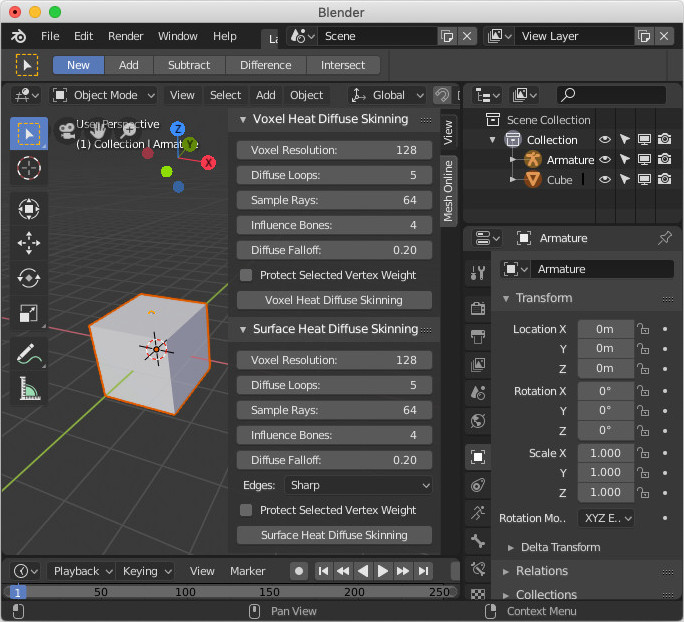

# Surface-Heat-Diffuse-Skinning
Experiment of prototype concepts.
# Introduction
Blender already has built-in bone heat weighting, it works well in most time, but sometimes it fails to find a solution.

This projet is an experiment of prototype concepts, I try to use iterations to approach a stable solution.

The source code of the octree part is not optimized, it runs quite slow, but the source code is easy to read and understand.

Edit: I have replaced the octree with naive voxel grid, the speed is stupidly fast now.

# Download
http://www.mesh-online.net/shd-blender-addon.zip (Last updated on April 2, 2019)

This is the pre-built product, unzip the zip file, launch Blender, navigate to File->User Preference->Addons, click the 'Install Add-on from file...' button, a pop up dialog will appear, go to either 'shd-blender-addon/addon/2.7' or 'shd-blender-addon/addon/2.8', select 'shd.zip', click the 'Install Add-on from file...' button on the pop up dialog, the addon will be installed to Blender's addons directory.

When the pop up dialog closed, we are still on Addons page, activate the 'Surface Heat Diffuse Skinning' addon, then click the 'Save User Settings' button and close the 'Blender User Preference' window.

# Blender 2.8 Beta Support
The latest pre-built product contains both release for Blender 2.7 and release for Blender 2.8 Beta, you may choose the corresponding version to install.

Type 'n' key in the 3d view if the sidebar is hidden. If you select both the meshes and the armature, the user interface will appear in 'View3D->UI->Mesh Online' tab of the sidebar.

# Build
There is a 'Readme.txt' in the 'src' sub-directory.

# Install
Build the project from source code, then copy the binary to corresponding directories:

'Surface-Heat-Diffuse-Skinning/addon/surface_heat_diffuse_skinning/bin/Windows': Windows(64bit).

'Surface-Heat-Diffuse-Skinning/addon/surface_heat_diffuse_skinning/bin/Linux': Linux(64bit).

'Surface-Heat-Diffuse-Skinning/addon/surface_heat_diffuse_skinning/bin/Darwin': macOS(64bit).

Copy all the contents in 'Surface-Heat-Diffuse-Skinning/addon' to Blender's add-ons directory.

Launch Blender, from 'File->User Preferences...', activate the 'Surface Heat Diffuse Skinning' addon, then click the 'Save User Settings' button and close the 'Blender User Preference' window.

Note: The pre-built version has added support for 32 bit of Windows and Blender 2.8 Beta, so the Python script files and the directory structure has changed. If you choose to build from source, please use the Python script files and directory structure in the pre-built version.

# Usage
Select all the sub-meshes and one armature, the interface will appear on the tool shelf section of 'View3D->Tools->Animation'.

Just click the 'Surface Heat Diffuse Skinning' button with the default parameters to skin your 3d model.

Visit the support page to learn more details.

# Support
http://www.mesh-online.net/voxel.html

# License

The MIT License (MIT)

The project has been released under the very permissive MIT license.

Everyone can freely modify the source code and use the source code in their own projects.

Any improvements are welcome.
